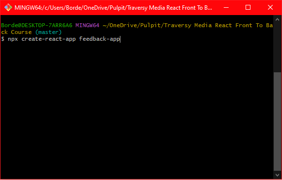
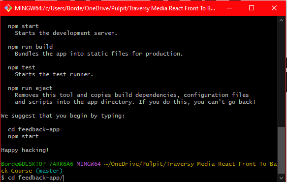
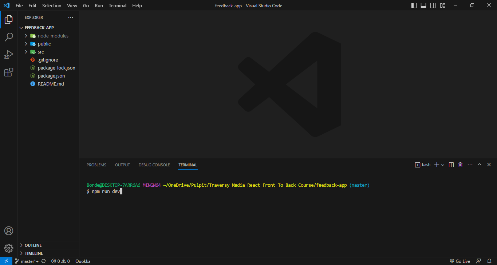

# **Create React App**

In order to create new React application fallow these steps:

## **Step By Step Start**

Open up terminal and run following command:

```bash
    npx create-react-app app-name
```



After all dependencies are installed change the directory to the new app folder:

```bash
    cd app-name/
```



Follow with the next command to open current file in your code editor:

```bash
    code .
```

Open integrated terminal and run script to start dev server:

```bash
    npm start
```



Clear up comments from index.html file in public folder. You can put CDNs here, google fonts, fontawesome and other meta tags.

Delete everything for src folder.

Link to React documentation:
https://react.dev/learn/start-a-new-react-project
