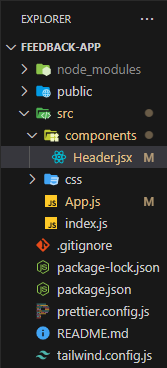
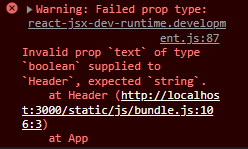

# **Components, Props & Prop Types**

The rest of this documentation will be focused around practical project and all the examples will be from that project.

To keep our filestructure more organized we hold our components inside components file.



React components must be names with capital letter and with js or jsx/tsx extenstion.

## **Snippets**

With React snippets we can create our basic components way faster.

```jsx
// Create functional component
rfc;

// Create and export functional component
rfce;
```

We no longer have to import React into each component.

Lets create Header component for our app.

```jsx
// Header.jsx

function Header() {
	return (
		<header>
			<div className="container">
				<h2>Feedback UI</h2>
			</div>
		</header>
	);
}

export default Header;
```

To use created component we need to import it into right place. Remember to wrap jsx into html fragment.

```jsx
// App.js

import Header from './components/Header';

export default function App() {
	return (
		<>
			<Header />
			<div className="container">
				<h1>My App</h1>
			</div>
		</>
	);
}
```

## **Props**

Propes are passed in the component are essentially a property of that component. Props can be of different data types. Let's add a dynamic prop to Header component.

```jsx
// App.js

<Header text="Feedback UI" />
```

When we pass a prop into component we need to cath it in order to use it.

### **There are two ways to cath a prop**

1. We can pass props object as function agrument:

```jsx
// Header.jsx

function Header(props) {
	return (
		<header>
			<div className="container">
				<h2>{props.text}</h2>
			</div>
		</header>
	);
}

export default Header;
```

2. We can destructure props object (This is more advised):

```jsx
// Header.jsx

function Header({ text }) {
	return (
		<header>
			<div className="container">
				<h2>{text}</h2>
			</div>
		</header>
	);
}

export default Header;
```

### **Default Props**

We also can set dafault props. Let's get rid of text prop.
If no prop was passed in, default prop will be displayd.

```jsx
// Header.jsx

Header.defaultProps = {
	text: 'Feedback UI',
};
```

### **Prop Types**

Prop types are essentially a type checking for your props, it works like TypeScript interfaces and types and PropTypes can changed for TypeSctipt. Addind prop types to our code will make it more robust and less error prone as it gives usefull warnings to the console. First we need to import PropTypes.

```jsx
// Header.jsx

// Importing prop types
import PropTypes from 'prop-types';

function Header({ text }) {
    return (
        // JSX code with prop
    )
}

Header.propTypes = {
    text: PropTypes.string,
}

export default Header
```

If we pass wrong prop type we will en an warning

```jsx
// App.js

import Header from './components/Header';

export default function App() {
	return (
		<>
			<Header text={true} />
			<div className="container">
				<h1>My App</h1>
			</div>
		</>
	);
}
```

Passing wrong prop type result:


