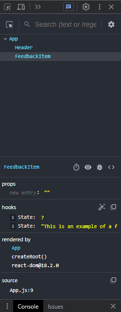

# **State & useState Hook**

State is basicly just data and it makes React 'react' to changes in state. It renders the DOM when change in state was detected. There are two types of state, app level state and component level state.

-   Component level state - Data associated with singular component, other component don't need to know this state. Component level state can be date about the navigation, is it open or closed?

-   App level state - Data needed in multiple components eg. our feedback item that we will create in this section.

## **Setting State in React components**

Let's create new component in our components file called FeedbackItem.jsx and scaffold functional component.

```jsx
// FeebackItem.jsx

export default function FeedbackItem() {
	return (
		<div className="card">
			<div className="num-display">10</div>
			<div className="text-display">
				This is an example of a feedback item
			</div>
		</div>
	);
}
```

Bring this compontnt into App.js

```jsx
// App.js

import Header from './components/Header';
import FeedbackItem from './components/FeedbackItem';

function App() {
	return (
		<>
			<Header />
			<div className="container">
				<FeedbackItem />
			</div>
		</>
	);
}
```

## **Using useState**

We want to make our rating and text as state and in order to do so we need to import Hook from React.

All Hooks start with use and we import them from react library using destructuring.

```jsx
// FeedbackItem.jsx

import { useState } from 'react';
```

In order to sate state we need to destructure an array with specific name convention.

```jsx
// FeedbackItem.jsx

import { useState } from 'react';

export default function FeedbackItem() {
	const [rating, setRating] = useState(10);
	const [text, setText] = useState('This is an example of a feedback item');

	return (
		<div className="card">
			<div className="num-display">{rating}</div>
			<div className="text-display">{text}</div>
		</div>
	);
}
```

In the useState parentheses we set default state.
We can look at state as a dynamic data that is passed as JSX expression. State is by default immutable and is changed by destructured setter function. state and setState can are simmilar to object getters and setters methods.

### **React Dev Tools**

In previous modules we installed React Dev Tools, that help us while working with components. Let's take a look at the FeedbackItem inside dev tools.
Open browser dev tools and selete in the topbar Components setion.



We can peek here at out props and current state of our app and component level states.

### **Changing piece of state**

As I mentioned above the state is immutable by default so we need to call setter function.

To test this let's add temporarily button with click event.

```jsx
// FeedbackItem.jsx

import { useState } from 'react';

export default function FeedbackItem() {
	const [rating, setRating] = useState(7);
	const [text, setText] = useState('This is an example of a feedback item');

	const handleClick = () => {
		setRating(10);
	};

	return (
		<div className="card">
			<div className="num-display">{rating}</div>
			<div className="text-display">{text}</div>
			<button onClick={handleClick}>Click</button>
		</div>
	);
}
```

First we create a button with onClick event where we pass in handleClick function. It is common convention to adding 'handle' as a prefix to events in React environment. Then we create set function and use setRating function isnide of it.

### **States in React are immutable**

Changing the state directly will not work, state is set using setter functions.

```jsx
// FeedbackItem.jsx

import { useState } from 'react';

export default function FeedbackItem() {
	const [rating, setRating] = useState(7);

	rating = 10; // This will  not work

	return <h1>{rating}</h1>; // rating = 7
}
```

There might be cases in which we need to acces previous state.
To get previous state we need to change our setState function. In setRating we add callback fuction that takes in prev agrument.

```jsx
// FeedbackItem.jsx

const handleClick = () => {
	setRating((prev) => {
		console.log(prev);
		return prev + 1;
	});
};
```

In order to follow project furter we need to delete button with event and function that we just created.
