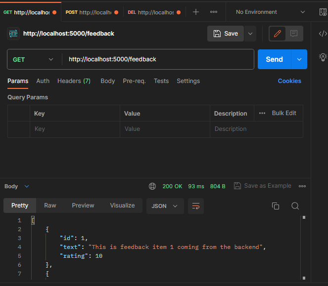
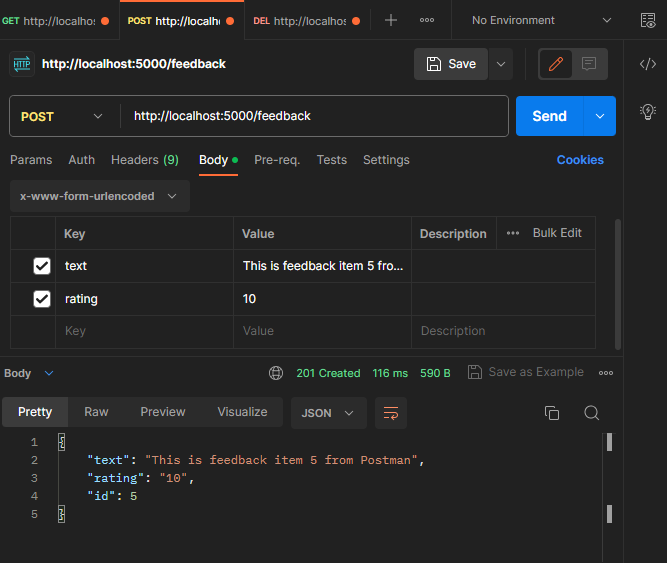
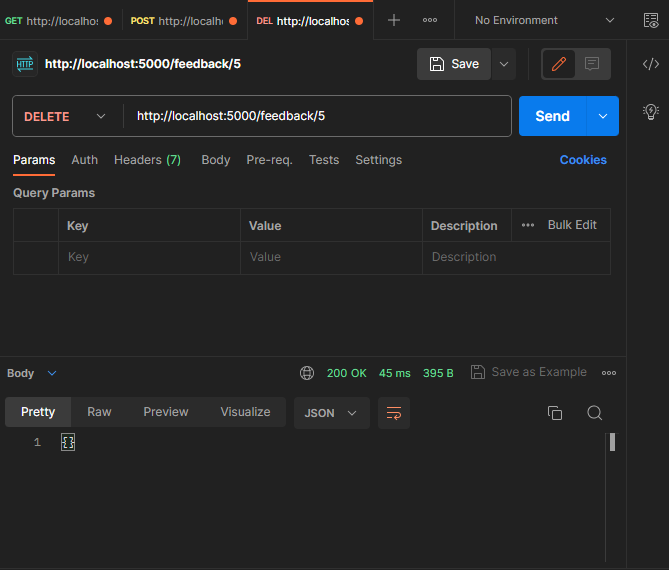

## **Setting Up JSON-Server Mock Backend**

In this section we will install JSON Server which will act as our backend. The way it works is we need to create a JSON file and it will act as our API with database. We can manke GET requests to fetch our data, using POST will create new piece of data. PUT/PATCH are for updates specific pieces of data. And lastle we can make a DELETE request which is self explanatory.

## **Setting up JSON Server**

First thing to do is to install in via npm

```npm
npm i json-server
```

Next let's add a script in our package.json file to start a server. We will need to add w watch flag with the database name and also we will need to specify the port that our server will run on.

```json
// package.json

"scripts": {
    "server": "json-server --watch db.json --port 5000"
}
```

Now we need to create that database file called db.json. Create in inside root element. This file will store feedback for our application.

```json
// db.json

{
	"feedback": [
		{
			"id": 1,
			"text": "This is feedback item 1 coming from the backend",
			"rating": 10
		}
		{
			"id": 2,
			"text": "This is feedback item 2 coming from the backend",
			"rating": 9
		}
		{
			"id": 3,
			"text": "This is feedback item 3 coming from the backend",
			"rating": 2
		}
	]
}
```

When posting new feedback JSON Server will autimatically add a id to out feedback and auto increment it, then we can remove the uuid package that we used to generate ids for our feedback items.

Now we should be able to run our server using terminal window.

```npm
npm run serve
```

So this command will run our server on localhost:5000 and we will now check if the server is worknig propperly.

## **Postman**

Postman is a great service for testing HTTP requests so let's test GET, POST and DELETE using Postman. Fists log into service and then open a new workdace and type in the URL http://localhost:5000/feedback and choose GET request.

### **GET Request**



This request will display all of our feedback, we can also specify to only display one piece of feedback.

### **POST Request**

To make a POST request we need to add propper keys and values to them. We simply need to follow the schema specified in our db.json file to make a sucesfull request.



### **DELETE Request**

To delete a piece of feedback we will need to specify which piece of feedback we want to delete by passing a param to the reuquest. The param here is of course our id.


