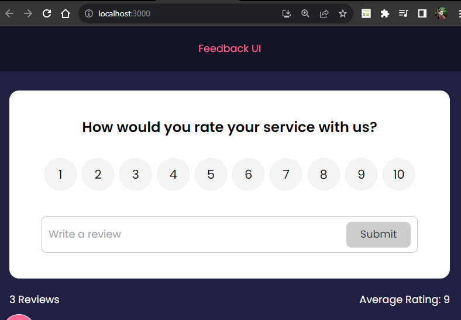
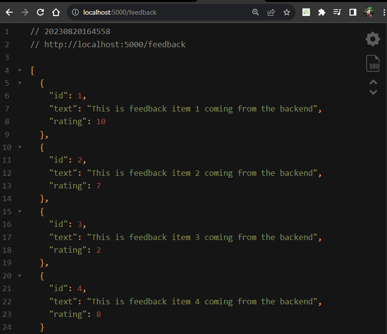

# **Run Client & Server With Concurrently**

Now one additional setep to take is purely a convience. There is a package that lets us run multiple npm scripts at the same time called concurrently. We have our React client side app hosted at port 3000 and our server at port 5000 so we can combine two commands responsible for starting our dev server and json server into one command.

Let's start by installing concurrently package.

```npm
npm i concurrently
```

Once that is done we can go inti our package.json and create new script that will combine two other scripts.

```json
// package.json

"scripts": {
    "dev": "concurrently \"npm run server\" \"npm start\""
}
```

Now let's save that and test this command by running it in the terminal.

```npm
npm run dev
```

## **We should get our Feedback Application via localhost on port 3000.**



## **And if we type in the browser localhost:5000 we should get our db.json content.**


